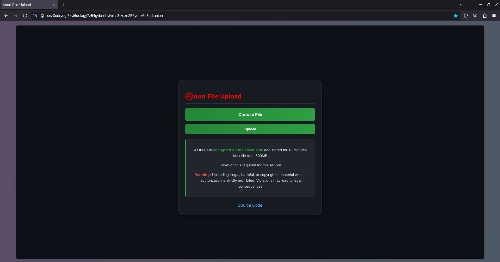

# Anon File Upload
## A tool for uploading/downloading files anonymously with client-side encryption
<!-- DESCRIPTION -->
## Description:

Anonymous file upload offers several key benefits. Primarily, it ensures user privacy and data security by allowing individuals to share files without revealing their identity, reducing the risk of personal information being exposed or misused. This feature is particularly valuable for whistleblowers, journalists, or anyone needing to share sensitive information without fear of retaliation. Additionally, it simplifies the process for users who do not want to go through the hassle of creating an account or logging in, enhancing convenience and user experience.

<!-- FEATURES -->
## Features:

- Stores uploaded file for 30 days
- Rate limiting
- Randomization of uploaded file name for privacy
- Built in PHP

## Technical details:

- AES-256-GCM for encryption
- Key is not sent to server

<!-- REQUIREMENTS -->
## Requirements:

- PHP
- Tor (for hosting onionsite)
- Apache or Nginx web server

<!-- SCREENSHOTS -->
### Screenshots:

<!-- LICENSE -->
## License

Distributed under the MIT License. See `LICENSE` for more information.